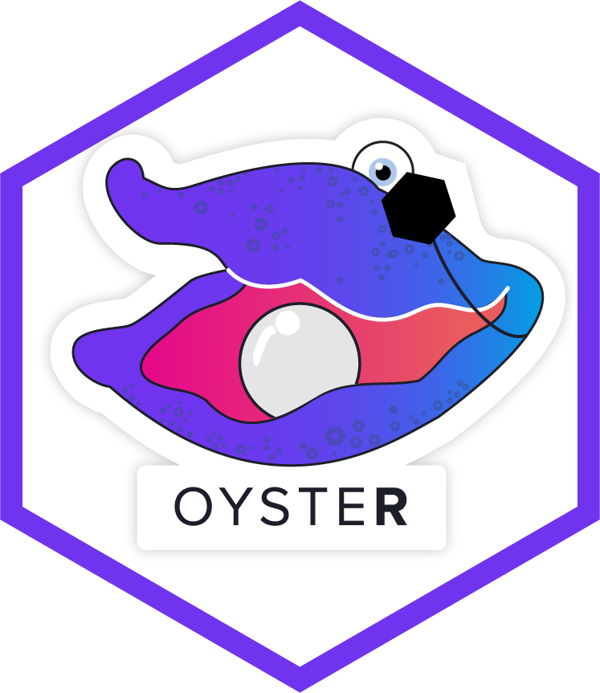

<!-- README.md is generated from README.Rmd. Please edit that file -->

# oysteR <a href="https://github.com/sonatype-nexus-community/oysteR"></a>

[](https://CRAN.R-project.org/package=oysteR)
[](https://github.com/sonatype-nexus-community/oysteR/actions)
[](https://app.circleci.com/pipelines/github/sonatype-nexus-community/oysteR)
[](https://app.codecov.io/gh/sonatype-nexus-community/oysteR?branch=master)
[](https://app.gitter.im/#/room/#sonatype-nexus-community_oysteR:gitter.im?utm_source=badge&utm_medium=badge&utm_campaign=pr-badge)

## Overview

This package aims to secure your R projects against insecure
dependencies using [OSS Index](https://ossindex.sonatype.org/).
Essentially, we check R packages for any *known* security
vulnerabilities. For a more in-depth discussion check out [this detailed
walkthrough](https://www.jumpingrivers.com/blog/r-package-vulnerabilities-security/)
by Colin Gillespie, one of the co-authors of `{oysteR}`.

The package has a few key functions for determining vulnerabilities:

-   `audit_installed_r_pkgs()` for scanning all currently installed R
    packages
-   `audit_description()` for scanning all packages (and their
    dependencies) in a DESCRIPTION file
-   Similarly, `audit_renv_lock()` and `audit_req_txt()`
-   `expect_secure()` for use within `{testthat}`

All of these functions ultimately parse relevant files and call the
`audit()` function.

## Usage

To get started, install the package and simply scan your installed
packages

``` r
library("oysteR")
audit = audit_installed_r_pkgs()
```

To extract the vulnerabilities into a nice data frame, use

``` r
get_vulnerabilities(audit)
```

### Within testthat

You can include this as part of your Unit testing framework, via
{testthat}. Simply create a file in tests/testthat and add

    test_that("Test expect_secure", {
      skip_on_cran()
      ## Tests function and this package
      oysteR::expect_secure("PKG_NAME")
    })

This test will pass if there are no known vulnerabilities. Remember to
add {oysteR} under Suggests in your DESCRIPTION file.

### Authentication

Heavy use against OSS Index will likely run you into rate limiting
(yikes!), but you can:

-   Register for an account on [OSS
    Index](https://ossindex.sonatype.org/)
-   Retrieve your API token after registering (on the User Settings
    page)

Set the following environment variables in your `.Renviron` file:

-   `OSSINDEX_USER` (this is set to your email address)
-   `OSSINDEX_TOKEN` (this is set to your API token)

Or create a config file at `~/.ossindex/.oss-index-config` and add

    # This config file is picked up by other Sonatype apps
    ossi:
       Username: XXXX
       Token: YYY

These will be used by `{oysteR}` to authenticate with OSS Index, bumping
up the amount of requests you can make.

## Contributing

We care a lot about making the world a safer place, and that’s why we
continue to work on this and other plugins for Sonatype OSS Index. If
you as well want to speed up the pace of software development by working
on this project, jump on in! Before you start work, create a [new
issue](https://github.com/sonatype-nexus-community/oysteR/issues), or
comment on an existing issue, to let others know you are!

## Reporting Missing Vulnerabilities

OSS Index contains data from public advisories. We do our best to keep
it up to date, but from time to time things may slip through the cracks.
If you notice some missing or incorrect data, please let us know! To
report missing or incorrect vulnerabilities in OSS Index data, create an
issue in the [vulnerability reporting
project](https://github.com/OSSIndex/vulns).

## Getting help

If you need help, then feel free to join us on the [oysteR
Gitter](https://app.gitter.im/#/room/#sonatype-nexus-community_oysteR:gitter.im) or raise an
an [issue](https://github.com/sonatype-nexus-community/oysteR/issues)

## The Fine Print

It is worth noting that this is **NOT SUPPORTED** by Sonatype, and is a
contribution of ours to the open source community (read: you!)

Remember:

-   Use this contribution at the risk tolerance that you have
-   Do NOT file Sonatype support tickets related to `{oysteR}`
-   DO file issues here on GitHub, so that the community can pitch in

Phew, that was easier than I thought. Last but not least of all:

Have fun creating and using this extension and [Sonatype OSS
Index](https://ossindex.sonatype.org/), we are glad to have you here!
